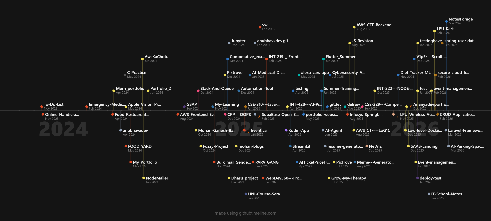
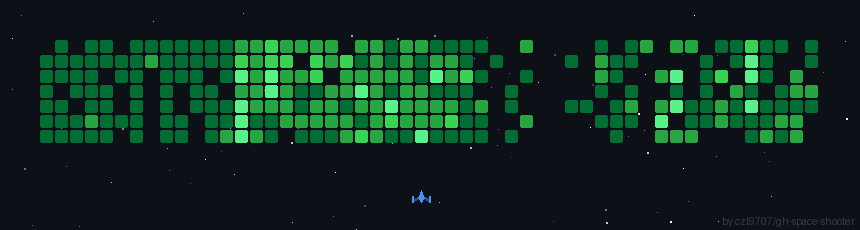

<div align="center">


[](https://git.io/typing-svg)

<p>
  <a href="https://www.linkedin.com/in/anubhavxdev/"></a>
  <a href="mailto:anubhavjaiswal1803@gmail.com"></a>
  <a href="https://anubhavxdev.vercel.app/"></a>
  <a href="https://discord.com/users/1184466463113891894"></a>
</p>


</div>

---

## 👋 About Me

```typescript
const anubhav = {
  name:       "Anubhav Jaiswal",
  role:       "Software Developer & AI Enthusiast",
  location:   "India 🇮🇳",
  portfolio:  "https://anubhavxdev.vercel.app",
  email:      "anubhavjaiswal1803@gmail.com",

  currentlyLearning: ["AI/ML", "LLMs & RAG", "System Design", "Rust"],
  interests:         ["Web Development", "DevOps", "Web3", "Cloud", "Open Source"],
  askMeAbout:        ["React", "Node.js", "Python", "Full Stack Development"],

  funFact: "I build things, break them, then build them better 🔁"
};
```

---

## 🛠️ Tech Stack

<details open>
<summary><b>Languages</b></summary>
<br>

</details>

<details open>
<summary><b>Frontend</b></summary>
<br>

</details>

<details open>
<summary><b>Backend & Databases</b></summary>
<br>

</details>

<details open>
<summary><b>Mobile</b></summary>
<br>

</details>

<details open>
<summary><b>DevOps & Cloud</b></summary>
<br>

</details>

---

## 🏅 Certifications

<div align="center">

<table>
  <tr>
    <td align="center">
      <br/>
      <sub><b>AWS Educate: Cloud 101</b></sub>
    </td>
    <td align="center">
      <br/>
      <sub><b>GitHub Foundations</b></sub>
    </td>
    <td align="center">
      <br/>
      <sub><b>OCI 2024 Foundations</b></sub>
    </td>
  </tr>
</table>

</div>

---

## 📊 GitHub Stats

<div align="center">


</div>

---

## 🏆 GitHub Trophies

<div align="center">


</div>

---

## 📈 Contribution Graph

<div align="center">



</div>

---

## 🔝 Top Contributed Repos

<div align="center">


</div>

---

### ✍️ Dev Quote of the Day

<div align="center">


</div>

---

<div align="center">



<br/>

**⭐ Star my repos if you find them useful! Feel free to connect and collaborate.**


</div>